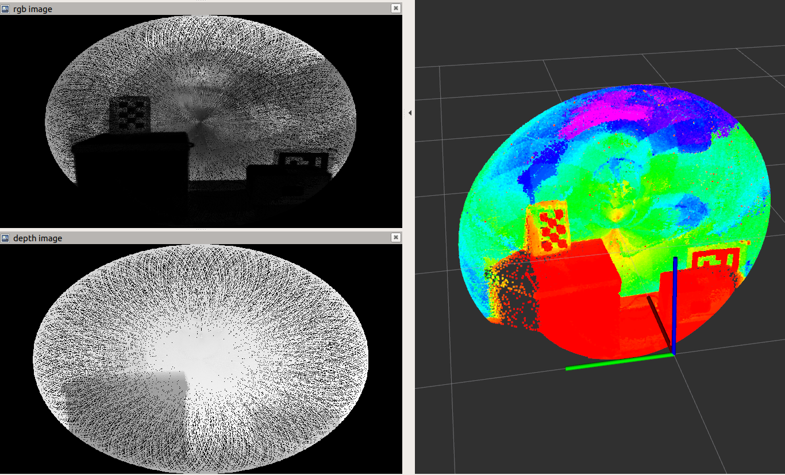

# Image Assembler

This implements a tool for converting 3D XYZI point cloud data to an RGB
(actually grayscale) image. This RGB image can then be used to run computer
vision algorithms. This includes but is not limited to running calibration
routines with checkerboards, contour finding, and image detection. Note that by
scaling down a 3D point cloud into a 2D image, the computation time required by
the downstream algorithms is significantly decreased. The output of this program
are an RGB image and a depth image. Example of an output can be seen below:


## Original Intent

This was originally designed for the Livox Mid70 Lidar. However, this can be
used for any lidar that captures different points in each scan and contains the
intensity of each 3D point in its raw data.

## ROS Topics

The depth_image and rgb_image topics should be remapped to outputs of the user's
choice. Note that both the depth and rgb image publishers are lazy. This means
that nothing will be published if there are no active subscribers (per topic)

## Parameters

- ```accumulate_time```: Accumulated images will be outputed this often; the
  period of the image outputs
- ```image_width```: Resultant rgb and depth image widths (in pixels)
- ```image_height```: Resultant rgb and depth image heights (in pixels)
- ```focal_point```: Focal point of camera; mostly used as a tuning parameter
- ```loop_rate```: This is the sampling rate - it should be at least 2x the rate
  of the lidar
- ```save_rgb_image_path```: Optional save path for debugging to view the RGB
  image

## Future Work

- Separate ROS code and create ROS1 wrapper
- Port into ROS2
- Add unit tests
